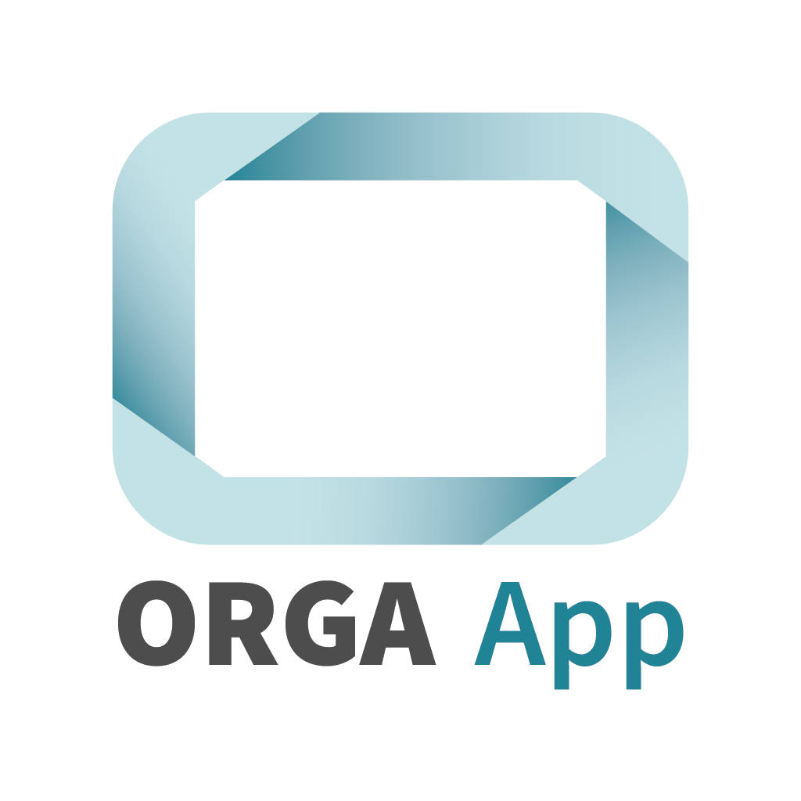
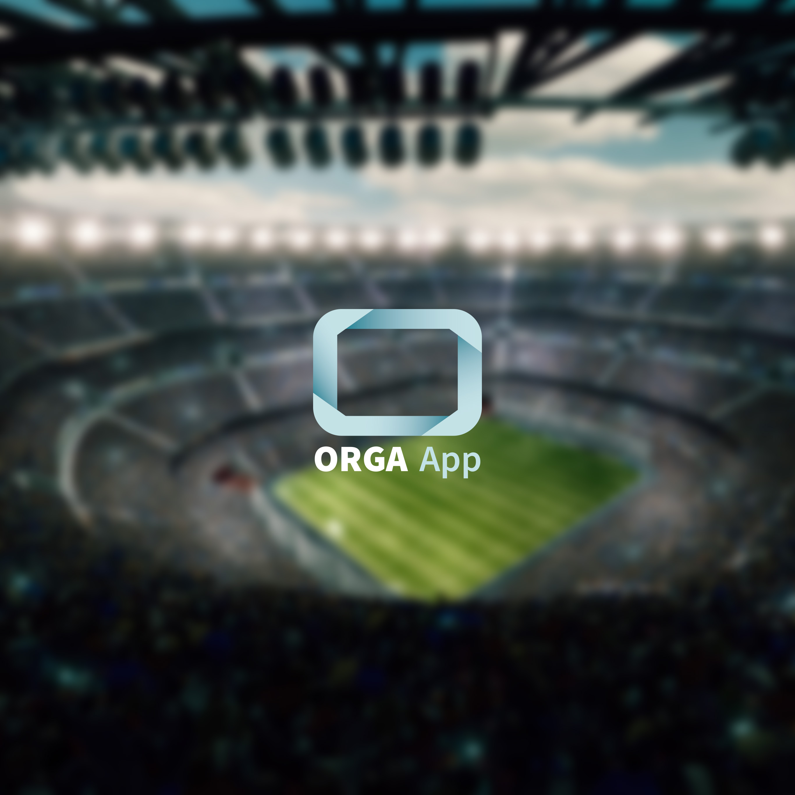

# ORGA App Onboarding - Branding

Für das Branding Ihrer App werden unterschiedliche Informationen und Dateien benötigt die folgend beschrieben sind. Bitte schicken Sie die Informationen anschließend per E-Mail an info@orgarena.de und verwenden als 
Betreff bitte "Theming - [IHR VEREIN]".

## Checkliste

- Apple
- Android
- Grafiken

## Apple

Zur Generierung der App für iOS Devices wird ein Enterprise Zertifikat mit entsprechendem Provisioning Profil und ein APN Key für Push Notifications benötigt. 

Das Zertifikat muss hierbei folgende Eigenschaften (Capabilities) beinhalten:
- Access WiFi Information
- AutoFill Credential Provider
- Push Notifications
- Wireless Accessory Configuration

Wir benötigen anschließend folgende Informationen:
- Team ID
- Bundle ID (App ID) 
- Apple Zertifikat (Format .p12) und das ensprechende Passwort
- Provisioning Profile (Format *.mobileprovision)
- APN Key Datei (Format *.p8)

Bitte geben sie auch das Ablaufdatum (Expiration Date) für das Zertifikat und das Provisioning Profile mit an, damit wir die erneute Generieung der App einplanen können.

## ANDROID

Zur Generierung der Android App benötigen wir folgende Punke:

- Android keystore (Format *.keystore)
- Store Passwort
- Alias
- Alias password

## Grafiken

Zur Erstellung des App Logos und des Splash Screens für den Start der App, werden zwei Dateien in den folgenden Formaten benötigt.

Logo 1024px x 1024px (Format *.png)

Splashscreen 2732px x 2732px (Format *.png)

