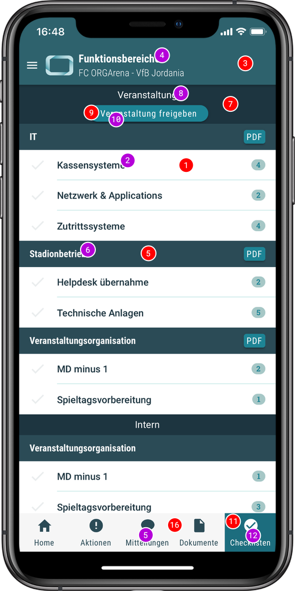
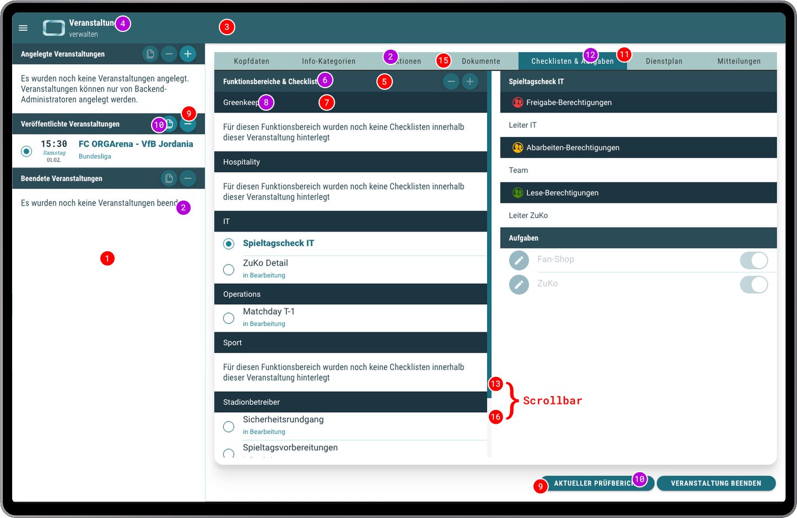

# ORGA App Farben

Die ORGA App kann durch eigene Farben individualisiert werden. Welche Farben das sind, in welchem Format sie benötigt
werden und an welchen Stellen sie zum Einsatz kommen, wird im Folgenden erklärt.

## Übersicht der verwendeten Farben

**-bg** (background): Hintergrundfarbe. Hauptsächlich für Flächen. Kann natürlich auch für Schriften, Linien u.s.w.
genutzt werden

**-fg** (foreground): Schrift- bzw. Kontrast-Farbe für eine bestimmte Hintergrundfarbe

Die HEX und RGB Angaben beziehen sich auf den **sRGB Farbraum**.

| #   | Beschreibung        |                                                       | HEX     | RGB         |
| --- | ------------------- | ----------------------------------------------------- | ------- | ----------- |
| 1   | background          |                | #ffffff | 255 255 255 |
| 2   | text                |    | #2b4b56 |  43  75  86 |
| 3   | primary-bg          |           | #2e626d |  46  98 109 |
| 4   | primary-fg          |                | #ffffff | 255 255 255 |
| 5   | primary-shade1-bg   |    | #2b4b56 |  43  75  86 |
| 6   | primary-shade1-fg   |                | #ffffff | 255 255 255 |
| 7   | primary-shade2-bg   |    | #1d3540 |  29  53  64 |
| 8   | primary-shade2-fg   |                | #ffffff | 255 255 255 |
| 9   | secondary-bg        |         | #1d8495 |  29 132 149 |
| 10  | secondary-fg        |                | #ffffff | 255 255 255 |
| 11  | secondary-shade1-bg |  | #1d6d7e |  29 109 126 |
| 12  | secondary-shade1-fg |                | #ffffff | 255 255 255 |
| 13  | secondary-shade2-bg |  | #1c5b6c |  28  91 108 |
| 14  | secondary-shade2-fg |                | #ffffff | 255 255 255 |
| 15  | contrast1           |            | #f8f8f9 | 248 248 249 |
| 16  | contrast2           |            | #f6f6f7 | 246 246 247 |
| 17  | contrast3           |            | #a6c7c6 | 166 199 198 |
| 18  | contrast4           |            | #caeae9 | 202 234 233 |

## Anwendung der Farben in der mobilen App

| Indikator                                         | Beschreibung                |
| ------------------------------------------------- | --------------------------- |
|  | Hintergrund Farbe           |
|      | Vordergrund (Schrift) Farbe |

## Anwendung der Farben im Desktop Client

