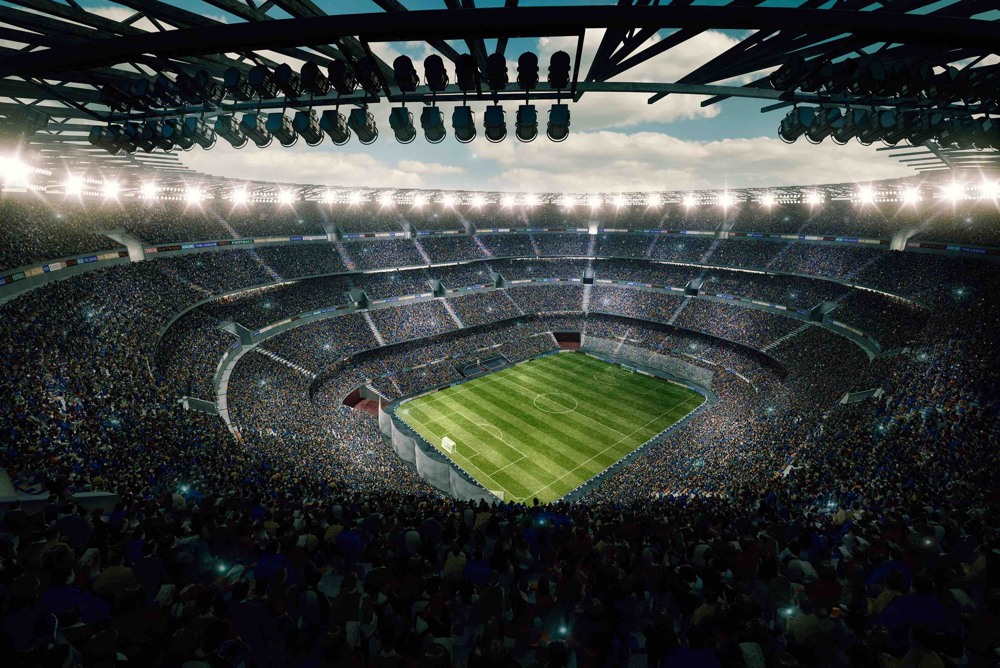
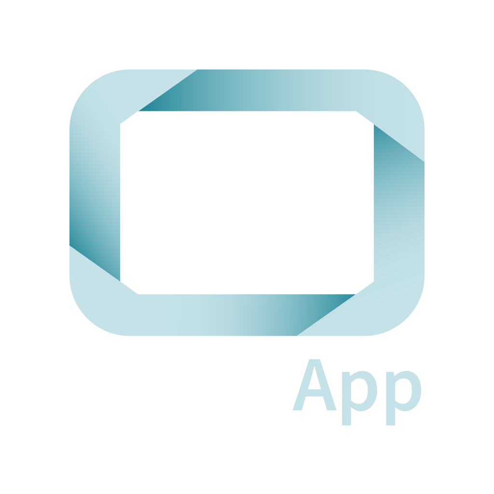
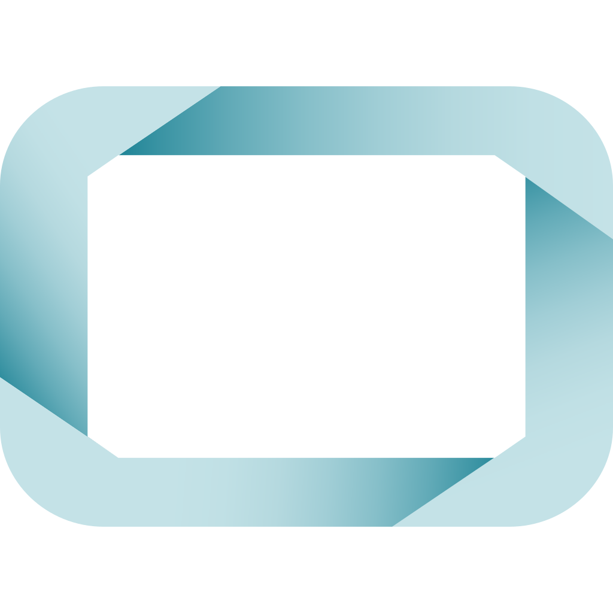
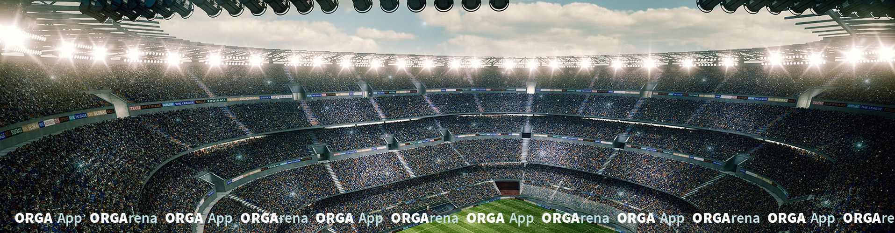
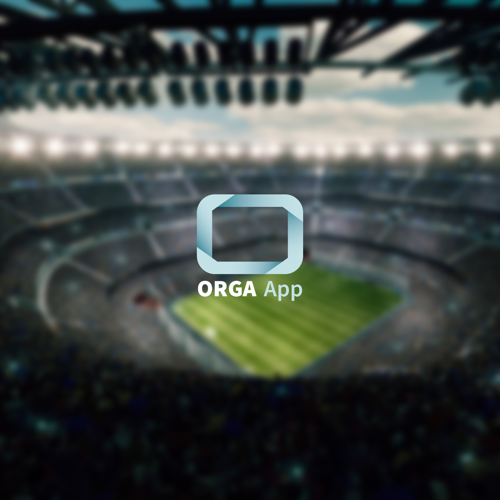
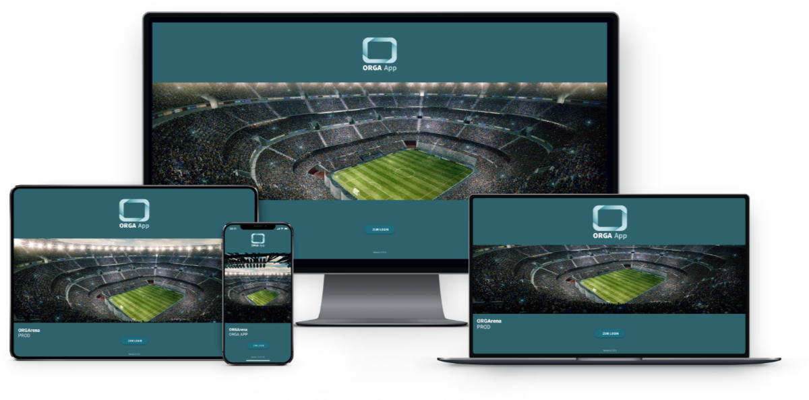
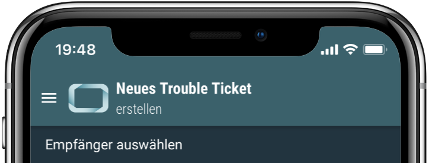
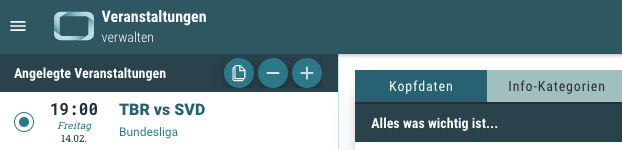
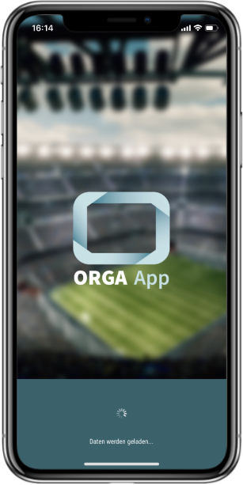

# ORGA App Grafiken

Die ORGA App kann durch eigene Grafiken individualisiert werden. Welche Grafiken das sind, in welchem Format sie
benötigt werden und an welchen Stellen sie zum Einsatz kommen, wird im Folgenden erklärt.

## Übersicht aller verwendeten Grafiken

| Beispiel                                                       | Beschreibung                                                    | Format                          | Größe                        |
| -------------------------------------------------------------- | --------------------------------------------------------------- | ------------------------------- | ---------------------------- |
|    | [Login Hintergrund](#login-hintergrund)                         | jpg (72 dpi, sRGB)              | Mindestens 3300 x 2200 Pixel |
|               | [Logo](#logo)                                                   | skalierbares SVG (72 dpi, sRGB) | Mindestens 200 px hoch       |
|        | [Kleines Logo](#kleines-logo-optional) (optional)               | skalierbares SVG (72 dpi, sRGB) | Mindestens 40 x 40 Pixel     |
|  | [Update Hintergrund](#update-hintergrund-optional) (optional)   | jpg (72 dpi, sRGB)              | 1900 x 500 Pixel             |
|  | [Loading Hintergrund](#loading-hintergrund-optional) (optional) | jpg (72 dpi, sRGB)              | 1600 x 1600 Pixel            |

## Login Hintergrund

Der Login Hintergrund wird auf den Login Screens der mobilen App und des Desktop Clients angezeigt. Um ein möglichst
breites Spektrum an verschiedenen Displays abzudecken, sollte diese Grafik also relativ groß sein. Wir empfehlen eine
Mindestgröße von **3300 Pixel in der Breite** und **2200 Pixel in der Höhe**. Da die Grafik ausschließlich für die
Anzeige auf Monitoren bzw. Displays genutzt wird, reicht eine Auflösung von **72 dpi**. Als Frabraum verwenden wir
**sRGB** (falls Ihre Grafik in einem anderen Farbraum erstellt wurde, wird sie in sRGB umgewandelt). Die dpi und
Farbraum Abgaben gelten auch für alle restlichen Grafiken und werden deshalb im Folgenden nicht weiter erwähnt.

In der folgenden Abbildung (*Abb. 1*) sehen Sie beispielhaft, wie die Grafik auf den verschiedenen Geräten angezeigt
wird:

*Abb. 1*

## Logo

Das Logo wird an verschiedenen Stellen in unterschiedlichen Größen in der mobilen App und im Desktop Client eingesetzt.
Damit das Logo auf den verschiedenen Endgeräten immer gut aussieht, wird ein skalierbares vektor Format (SVG) benutzt.

Auf dem Login Screen (*Abb. 1*), dem Update Screen (*Abb. 4*) und dem Loading Screen (*Abb. 5*) benutzt. Des Weiteren
wird es in der mobilen App (*Abb. 2*) und dem Desktop Client (*Abb. 3*) oben links im Titel Bereich angezeigt. Hier
besteht auch die Möglichkeit, ein [kleineres Logo](#kleines-logo-optional) zu verwenden.

Zu beachten ist auch die **Farbe der Hintergrundfläche**, auf der das Logo platziert wird. Am Beispiel der ORGA App
sieht man, dass wir als Hauptfarbe ein Türkis Blau gewählt haben. Das Wort "ORGA" in dem Schriftzug unter unserem Logo
ist weiß. Bei unserer Hintergrund Farbe funktioniert das gut, aber bei einer helleren Farbe würde das nicht
funktionieren. Dies gilt es zu beachten.

**Titel Bereich der mobilen App**

*Abb. 2*

**Titel Bereich des Desktop Clients**

*Abb. 3*

## Kleines Logo (optional)

Zusätzlich zum oben beschriebenen Logo kann auch ein weiteres (kleineres bzw. reduzierteres) Logo benutzt werden.
Dieses wird dann ausschließlich im Titel Bereich der mobilen App und des Desktop Clients eingesetzt. Am Beispiel des
ORGA App Logos sieht man, dass wir hier auf den Schriftzug verzichtet haben (*Abb. 1 und 2*), weil das Logo an diesen
Stellen relativ klein dargestellt wird. Sollte ein solches Logo. Das kleine Logo ist optional. Sollte es nicht gewünscht
sei, wird an diesen Stellen das "normale" Logo angezeigt.

## Update Hintergrund (optional)

Auf dem sogenannten In-App Update Screen läuft eine Grafik in einer kleinen Animation von Rechts nach Links über das
Display. Die Grafik sollte deshalb relativ breit (wir empfehlen **1900 Pixel**) und in der Höhe sehr reduziert sein
(ca. **500 Pixe**l). Diese Grafik ist optional. Sollte sie nicht gewünscht sein, wird sie aus der Grafik für den Login
Hintergrund erstellt.

*Abb. 4*

## Loading Hintergrund (optional)

Nachdem die mobile App gestartet und der ORGA App Splash Screen angezeigt wurde, kann je nach Leistung des Endgeräts
und/oder der Qualität der Internet Verbindung für kurze Zeit eine sogenannter Loading Screen angezeigt werden, bevor man
zum oben beschriebenen Login Screen gelangt. Auf diesem Screen kann auch eine individuelle Grafik (ink. Logo) angezeigt
werden. Wir empfehlen eine Mindestgröße von **1600 x 1660 Pixel**. Diese Grafik ist optional. Sollte sie nicht gewünscht
sein, wird sie aus der Grafik für den Login Hintergrund erstellt.

*Abb. 5*
